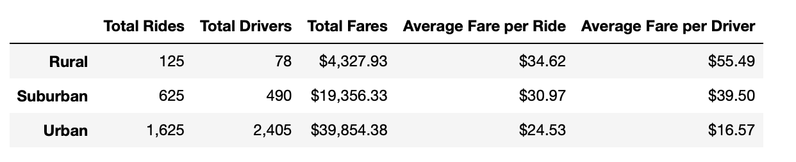
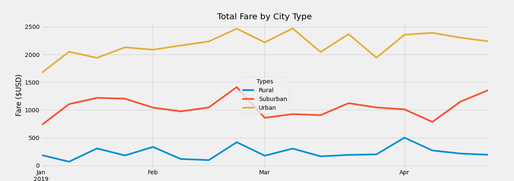

# PyBer with Matplotlib

## Overview of the Analysis

The study looked at ride sharing data of 2375 rides that took place in 120 different cities. Based on city type, an anlysis was done on total rides, total drivers, total fares, average fare per ride and average fare per driver. The total weekly fares for urban, suburban and rural city types from January to April 2019 was also visualized in a line chart.

The goal of the study is to determine the trends of the aformentioned metrics per city type. This information 
will be used to make recommendations that will help a ride sharing company improve access and affordability for its services in different neighborhoods.

## Results
 
</img>
 

### Total Rides

The most number of rides happened in urban cities with 1,625 rides. This was then followed by suburban cities with 625 rides. At 125 rides, rural cities had the least number of rides. 

### Total Drivers

At 2,405 drivers, urban cities had the most number of drivers among any city type. Meanwhile, 490 and 78 drivers were found in suburban and rural cities respectively. 

### Total Fares

Urban cities took the lead in most fares collected at $39,854.38. This was followed by suburban cities with $ 19,356.33 in total fares. Finally, rural cities collected $4,327.93 which is the least amount of fares collected in total among any city type. 

### Average Fare per Ride

Rural cities had the highest average fare per ride at $34.62 per ride. Meanwhile, the average fare per ride in suburban cities was $30.97 per ride. Urban cities had the lowest average fare per ride among any city type at $24.53 per ride.  

### Average Fare per Driver

Rural cities had the highest fare per driver at $55.49 per driver. This was followed by suburban cities whose fares were $39.50 per driver. The drivers in urban cities generated the least average fare at $16.57 per driver. 

 
</img>
 

### Total Fare by City Type

For the first four months of 2019, the total weekly fares of urban cities stayed mostly above $2000/week. In particular, certain weeks in late February and early March had fares peak at $2500.

In the same time period, average weekly fares collected in suburban cities oscillated around $1000/week. The last week of February also experienced a peak in weekly collected fares at $1500. 

Weekly fares collected in rural cities consistently stayed below $500/week throughout this 4 month period. Most notably, the last week of February and the first week of April saw spikes in weekly fares collected. 

## Summary

Based on the data, the number of rides in urban areas is more than 10 times the number of rides in rural areas. This explains the large discrepancy in the total fares collected between the two city types. Rural cities have less public transportation than urban cities because of their relatively smaller population. As a result, rural dwellers are more likely to own a car which makes them less likely to resort to ride sharing. To encourage the usage of this service, the company should offer significant discounts in rural areas where ride sharing is infrequent. This allows them to offer a convenient service to customers at a price that can compete with the cost of driving ones own car.  

The data also shows a discrepancy of about $20,000 in total fares collected between urban and suburban city types. Suburban city dwellers often make trips to the downtown core of nearby urban cities for work. The company can partner with the local transit system in order to shuttle commuters to and from major bus stops and/or train stations. This will increase the use of ride sharing since it offers suburban customers a more seamless commute by eliminating the issue of parking at stations. 

 Both suburban and rural cities experienced an increasing trend in total fares up to the last week of February. To sustain this trend, the company should offer a special promotion that reduces the price of rides
 for a couple of weeks after this peak. In fact, a ride sharing loyalty program can even be used to encourage consistent usage of the service year-round! Special rates and rewards will be offered at different ranges of ride frequencies per month. Since the rewards get better at higher riding frequencies, customers are positively reinforced with savings and special priviledges for their continued usage. 

